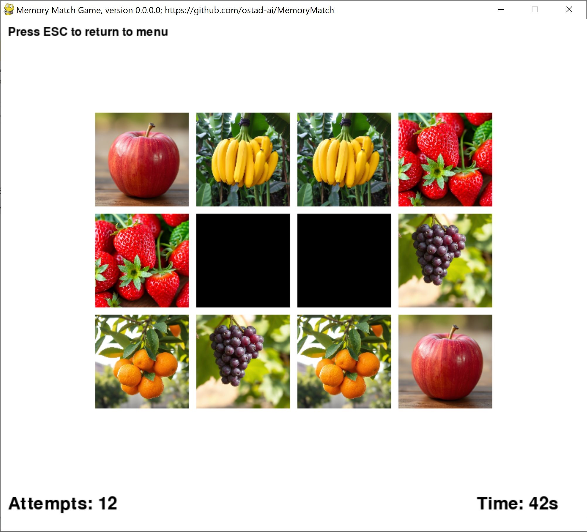

# Memory Match
This is a **memory match game** in which the player first chooses the **theme** and the **difficulty**. Then he/she starts the game. In the game, the player needs to find the matching cards. This game seems to be a good tool for keeping your memory active and/or enhancing it.
1. Start the game by clicking the green button **start** in the menu window.
2. Move the cursor by **Mouse wheel** over the cells of the grid that holds the cards. Then, click by *mouse button* on two cells that you think they are a pair.
3. After finding all pairs, you win the game and the statistics of your game is shown along the best statistics you have done so far in this type of *difficulty*. At this stage, you have the choice to play again or to return to the menu.
4. You have several options for themes in the menu window. One special theme is called **Custom**. For this theme to work, you need to include at least eight different images in the folder **custom_theme**.
5. We also have three types of difficulty: **easy**, **medium** and **hard**. In the easy mode, we have 2-by-3 cells in the grid. In the medium mode, we have 3-by-4 cells in the grid. And finally in the hard mode, we have 4-by-4 grid cells.

## This archive includes the executable program: **memorymatch.exe**, which is suitable for **Windows 10** and over. You should click on the executable to run.
[Download the archive for win64](https://drive.google.com/file/d/1wtz2jlqXFdsrh2oDiieDaWJfqttJZ2Jx/view?usp=sharing)
---
 *Figure 1: A snapshot of MemoryMathc Game, version 0.0.0.0, while playing the game.*
---
